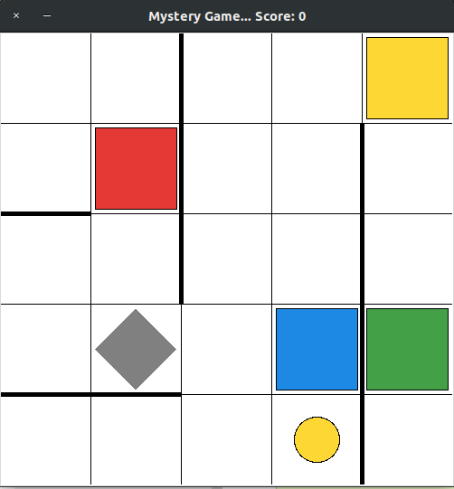

# Mystery Game

The game starts in a grid, but the goal of the game is not clear.
Neither are the controls.
The only thing that is known is that the game is controlled using numbers 1 through 6.

## Rules

1. **Goal:** Maximize the score
2. **How to do that:** ???
3. **Controls:**

   | Key | Action |
   |:---:|:------:|
   | 1   | ???    |
   | 2   | ???    |
   | 3   | ???    |
   | 4   | ???    |
   | 5   | ???    |
   | 6   | ???    |

## Simple game

You can run an example game using `game.py`.
You can give it `--grid-size` argument that specifies the world size.
The `--vwalls` and `--hwalls` specify the walls to be added.

For example

```
python ./game.py --grid-size 5x5 --vwalls 0x2x3 5x4x-4 --hwalls 4x0x2 2x0x1
```

creates a world:



## Reinforcement Learning Use

For RL use, send values to `agent.Agent.action` method to control the agent in the environment.

## Brief API

**Note:** Please, see the docstrings for details

**TODO:** Sphinx docs?

- `world.World` -- main entry point for the world generation.
  Has methods for creating world obstacles, targets, and the agent.
  **Note:** The interaction with the world is somewhat limited, so the interaction should be with the agents that interact with the world.
- `agent.Agent` -- a simple agent that can interact with the world.
  Defines the `action` method that takes a numeric input and performs an action.
- `color.Color` -- Data structure that defines the colors
- `movement` -- functions and data structures to control movement.
  This also includes functions that attach keyboard to the tag control.
